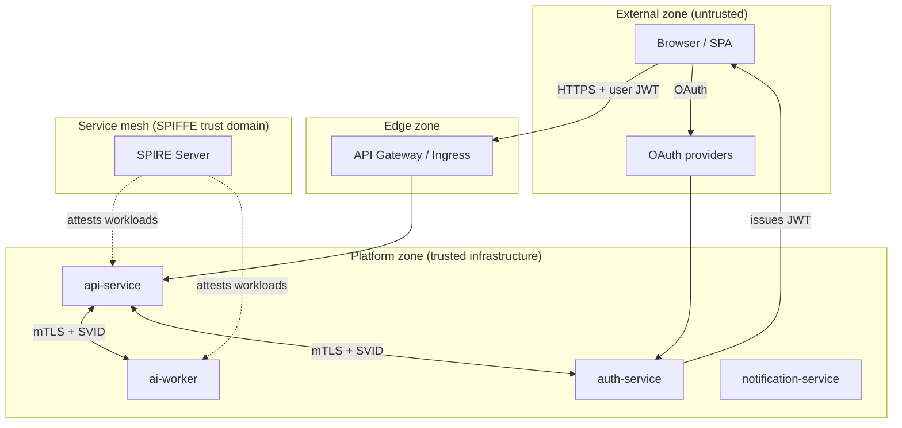

# Identity Propagation Across Microservices

How user identity, request context, and workload trust flow through the AI microservices platform — from the browser to background workers — with a path to SPIFFE/SPIRE and distributed tracing.

## 1. Design Goals

| Goal | Approach |
|------|----------|
| **User authentication** | Platform JWT issued by `auth-service`; validated locally per service |
| **User authorization** | RBAC from verified JWT `roles` claim — never from untrusted headers alone |
| **Request traceability** | `X-Correlation-ID` + `X-Request-ID` on every hop |
| **Service authenticity** | SPIFFE/SPIRE workload IDs + mTLS (production target) |
| **Observability** | W3C `traceparent` / OpenTelemetry-compatible baggage (future) |
| **Least privilege** | Services receive only the identity fields they need per call |

## 2. Two Layers of Identity

The platform separates **who the user is** from **which service is calling**:

```
┌─────────────────────────────────────────────────────────────────┐
│  LAYER 1 — User identity (OAuth + platform JWT)                 │
│  Issuer: auth-service │ Audience: ai_platform │ TTL: ~15 min    │
│  Carried: Authorization: Bearer <access_jwt>                    │
└─────────────────────────────────────────────────────────────────┘
                              │
                              ▼
┌─────────────────────────────────────────────────────────────────┐
│  LAYER 2 — Workload identity (SPIFFE/SPIRE via Docker Compose)    │
│  Issuer: SPIRE │ Subject: spiffe://ai-platform.local/workload/… │
│  Carried: mTLS client cert (X.509-SVID) on east-west HTTP/gRPC  │
└─────────────────────────────────────────────────────────────────┘
```

**Rule:** User JWT proves the end-user. SPIFFE SVID proves the calling microservice. Both are required for sensitive internal APIs.

## 3. Trust Model

### 3.1 Trust zones



### 3.2 What each component trusts

| Component | Trusts | Does not trust |
|-----------|--------|----------------|
| **Browser** | TLS to platform, auth-service token endpoint | Other users' tokens |
| **api-service** | JWT signature (`iss`, `aud`, `exp`), SPIFFE peer cert on outbound calls | Raw `X-User-ID`, `X-Roles` without JWT |
| **auth-service** | OAuth provider tokens (exchange only), SPIFFE for admin/internal APIs | User-supplied `sub` in body |
| **ai-worker** | SPIFFE caller + internal signed context OR service account | End-user JWT on worker queue (prefer job-scoped claims) |
| **notification-service** | Event envelope signed/at-tested by bus; SPIFFE for HTTP if any | JWT in email templates/logs |

### 3.3 SPIFFE/SPIRE on Docker Compose (current local model)

[SPIFFE](https://spiffe.io/) provides **workload identity** independent of network location. [SPIRE](https://spire.io/) is deployed via **Docker** in this repo (Kubernetes later).

| Concept | Platform mapping |
|---------|------------------|
| **Trust domain** | `ai-platform.local` |
| **SPIFFE ID** | `spiffe://ai-platform.local/workload/<service>` e.g. `.../workload/api-service` |
| **SVID** | Short-lived X.509-SVID from SPIRE agent |
| **Registration** | Docker label `spire.service=<compose-service>` + SPIRE entry |
| **Attestation** | SPIRE agent with `WorkloadAttestor "docker"` + mounted `docker.sock` |

**Setup:** see [infrastructure/spire/docker/README.md](../infrastructure/spire/docker/README.md)

```bash
docker compose -f docker-compose.yml -f infrastructure/spire/docker/docker-compose.spire.yml up -d
./infrastructure/spire/docker/scripts/bootstrap.sh
```

**Integration pattern:**

1. Run `spire-server` + `spire-agent` containers on the same Compose network as app services.
2. Label each app service with `spire.service=<name>` in `docker-compose.yml`.
3. Register workload entries (`registration/entries.sh`) mapping labels → SPIFFE IDs.
4. Mount SPIRE agent socket volume into services when enabling `SPIRE_ENABLED=true`.
5. User JWT remains in `Authorization`; SPIFFE proves which container called which.

**Kubernetes migration (later):** replace Docker attestor with `k8s_psat` + `k8s` attestors; keep the same SPIFFE ID paths under `spiffe://ai-platform.local/workload/...`.

**Dual attestation on internal calls:**

```
Internal HTTP request =
  mTLS (SPIFFE SVID)           → proves workload
  + Authorization: Bearer JWT  → proves user (when user-initiated)
  + X-Correlation-ID           → proves trace lineage
  + X-Internal-Context (opt.)  → signed service propagation (see §5)
```

## 4. JWT Propagation

### 4.1 Rules

1. **Ingress only from clients** — External callers send `Authorization: Bearer <access_jwt>`.
2. **Validate before use** — Every service validates signature, `iss`, `aud`, `exp`, and required claims before setting `g.user_id` / `g.roles`.
3. **Forward unchanged on sync chains** — When `api-service` calls another service on behalf of the user, forward the **same** Bearer token (token delegation), unless using a downscoped service token (future).
4. **Never log tokens** — `shared_logging` redacts `authorization`, `token`, `jwt` fields.
5. **Do not accept query-string tokens** — Header only.

### 4.2 Claims used downstream

| Claim | Propagation | Use |
|-------|-------------|-----|
| `sub` | → `g.user_id` | Resource ownership, audit |
| `roles` | → `g.roles` | RBAC |
| `session_id` | Logs + revoke flows | Session binding |
| `jti` | Logs | Revocation lists (future) |
| `email` | Logs (careful), notifications | Display only after verify |

### 4.3 Validation contract (all services)

```python
# Pseudocode — matches auth_service JwtTokenService / jwt_auth_middleware template
claims = jwt.decode(
    token,
    key=JWKS_OR_SHARED_SECRET,
    algorithms=["HS256"],  # or RS256 + JWKS in production
    audience="ai_platform",
    issuer="auth_service",
)
assert claims["token_type"] == "access"
```

## 5. User Identity Propagation

### 5.1 Canonical vs derived headers

| Header | Source | Trusted? |
|--------|--------|----------|
| `Authorization: Bearer …` | Client | **Yes**, after signature verification |
| `X-User-ID` | Any peer | **No** — informational only unless from gateway with mTLS |
| `X-Roles` | Any peer | **No** — use JWT `roles` only |
| `X-Session-ID` | Verified JWT `session_id` | **Yes**, if set by middleware after JWT verify |

**Platform rule:** Middleware sets `g.user_id` and `g.roles` from **verified JWT only**. Optional outbound headers (`X-User-ID`, `X-Roles`) are **derived** for convenience in logs and legacy adapters — receivers must re-validate JWT for authorization decisions.

### 5.2 Internal signed context (optional enhancement)

For calls where forwarding the user JWT is undesirable (long-lived worker, token size, different `aud`):

```json
// X-Internal-Context: base64url(JSON) + HMAC or nested JWT
{
  "sub": "user-uuid",
  "roles": ["user"],
  "session_id": "sess-uuid",
  "correlation_id": "corr-uuid",
  "caller_spiffe_id": "spiffe://ai-platform.local/ns/default/sa/api-service",
  "exp": 1716000900
}
```

Signed by `auth-service` or api-service with a **service-only** key, short TTL (≤5 min), `aud` scoped to target service.

## 6. Correlation ID Propagation

### 6.1 Header contract (implemented today)

| Header | Semantics | Generation |
|--------|-----------|------------|
| `X-Correlation-ID` | End-to-end business transaction | Client may supply; else copy from `X-Request-ID` |
| `X-Request-ID` | Single HTTP hop / attempt | Generated per inbound request if missing |

Implemented in `shared/shared_logging` → `register_flask_request_logging()`:

- Inbound: read or generate IDs → `flask.g`
- Outbound response: echo both headers
- Logs: `correlation_id`, `request_id`, `user_id` in JSON payload

### 6.2 Propagation rules

```
1. If X-Correlation-ID present on inbound → preserve on all outbound HTTP, AMQP, Celery
2. Each service MAY generate new X-Request-ID per outbound hop (optional) while keeping correlation stable
3. Domain events MUST include correlation_id in envelope metadata
4. Celery tasks inherit correlation_id from publisher via task headers
```

### 6.3 Event bus envelope

```json
{
  "event_type": "ProcessingRequested",
  "event_id": "uuid",
  "occurred_at": "2026-05-25T12:00:00Z",
  "metadata": {
    "correlation_id": "abc-123",
    "causation_id": "request-uuid",
    "user_id": "user-uuid",
    "producer_spiffe_id": "spiffe://.../sa/api-service"
  },
  "payload": { }
}
```

## 7. Distributed Tracing Compatibility

### 7.1 W3C Trace Context (future-ready)

| Header | Purpose |
|--------|---------|
| `traceparent` | `00-<trace-id>-<span-id>-<flags>` |
| `tracestate` | Vendor-specific trace metadata |

**Mapping to existing IDs:**

| Existing | OpenTelemetry | Notes |
|----------|---------------|-------|
| `X-Correlation-ID` | `baggage` entry `correlation_id` or business attribute | Keep for support dashboards |
| `X-Request-ID` | Span attribute `http.request_id` | Per-hop |
| — | `trace_id` in `traceparent` | 32 hex chars, globally unique |

### 7.2 Recommended rollout

1. **Phase 1 (now):** Correlation + request IDs in logs (done).
2. **Phase 2:** Add `traceparent` passthrough in shared HTTP client; no collector required.
3. **Phase 3:** OpenTelemetry SDK auto-instrument Flask/Celery/requests; export to OTLP (Jaeger/Tempo).
4. **Phase 4:** SPIFFE ID as resource attribute `service.instance.id`.

Log JSON already structured for trace/log correlation:

```json
{
  "timestamp": "...",
  "service": "api_service",
  "correlation_id": "abc-123",
  "request_id": "req-456",
  "user_id": "user-789",
  "trace_id": "4bf92f3577b34da6a3ce929d0e0e4736",
  "span_id": "00f067aa0ba902b7"
}
```

## 8. Request Flow Examples

### 8.1 User creates a job (sync HTTP chain)

```
Browser                    api-service                 ai-worker (HTTP)
   │                            │                            │
   │  POST /api/v1/jobs         │                            │
   │  Authorization: Bearer JWT │                            │
   │  X-Correlation-ID: abc     │                            │
   ├───────────────────────────►│                            │
   │                            │ validate JWT → g.user_id   │
   │                            │ g.correlation_id = abc     │
   │                            │                            │
   │                            │  POST /internal/process    │
   │                            │  Authorization: Bearer JWT │ (same token)
   │                            │  X-Correlation-ID: abc     │
   │                            │  mTLS + SPIFFE SVID        │
   │                            ├───────────────────────────►│
   │                            │                            │ verify JWT
   │                            │                            │ verify SPIFFE peer
   │                            │                            │ g.correlation_id = abc
   │                            │◄───────────────────────────┤
   │◄───────────────────────────┤ 201 + X-Correlation-ID   │
```

### 8.2 OAuth login (auth in hot path only)

```
Browser          auth-service        api-service (later)
   │                  │                     │
   │ GET /oauth/github/callback            │
   ├─────────────────►│                     │
   │                  │ OAuth + issue JWT  │
   │◄─────────────────┤ tokens             │
   │                  │                     │
   │ POST /api/v1/jobs + Bearer JWT        │
   ├──────────────────────────────────────►│
   │                  │                     │ local JWT verify only
   │                  │    (no auth call)   │
```

### 8.3 Async job via Celery (identity without forwarding JWT)

```
api-service              RabbitMQ              ai-worker (Celery)
     │                       │                        │
     │ validate JWT          │                        │
     │ publish event         │                        │
     │ metadata:             │                        │
     │  correlation_id       │                        │
     │  user_id, roles        │                        │
     ├──────────────────────►│                        │
     │                       ├───────────────────────►│
     │                       │   task headers carry   │
     │                       │   correlation_id       │
     │                       │   user_id (from event) │
     │                       │                        │ SPIFFE N/A on queue;
     │                       │                        │ trust event source
```

**Security note:** Message bus auth uses separate credentials; consumers validate `producer` identity via SPIFFE on publish side or signed event envelopes.

### 8.4 Service-to-service health/admin (no user)

```
api-service ──mTLS(SPIFFE)──► auth-service GET /health
  No Authorization header
  SPIFFE ID must match allowlist: spiffe://.../sa/api-service
```

## 9. Security Considerations

### 9.1 Threat matrix

| Threat | Mitigation |
|--------|------------|
| **Stolen user JWT** | Short TTL (15m), refresh rotation, optional `jti` blocklist |
| **Header spoofing** (`X-User-ID`) | Authorization only from verified JWT |
| **Token passthrough to untrusted 3rd party** | Never forward JWT to external webhooks |
| **Confused deputy** | SPIFFE caller ID + optional internal signed context with `aud` |
| **Replay on internal APIs** | Short-lived tokens; mTLS channel binding |
| **Log leakage** | Redact tokens in `shared_logging`; no JWT in query strings |
| **Privilege escalation** | RBAC from JWT `roles`; admin routes require `admin` role |
| **Compromised pod** | Short SVID TTL; SPIRE revocation; network policies |

### 9.2 JWT + SPIFFE combined decisions

| Scenario | User JWT | SPIFFE mTLS |
|----------|----------|-------------|
| Browser → api-service | Required | Ingress TLS |
| api-service → ai-worker (user job) | Required | Required |
| ai-worker → notification (event-driven) | In event metadata | Publisher SPIFFE / signed event |
| Cron / system task | Service account JWT or none | Required |

### 9.3 What not to do

- Do not implement custom “trust this IP” rules for identity.
- Do not pass refresh tokens between services.
- Do not embed PII in SPIFFE IDs or trace IDs.
- Do not use the same symmetric JWT secret in production across unrelated environments.

### 9.4 Production checklist

- [ ] RS256 + JWKS from `auth-service` (rotate keys)
- [ ] SPIRE deployed; all east-west traffic mTLS
- [ ] NetworkPolicy: deny pod-to-pod except mesh
- [ ] Gateway strips inbound `X-User-ID` / `X-Roles` from external clients
- [ ] Shared outbound HTTP client propagates correlation + traceparent
- [ ] Celery/RabbitMQ credentials per service
- [ ] OpenTelemetry collector with SPIFFE resource attributes

## 10. Implementation Map (Current Platform)

| Capability | Status | Location |
|------------|--------|----------|
| User JWT issue/validate | Done | `auth-service` `JwtTokenService` |
| Correlation / request IDs | Done | `shared/shared_logging` |
| JWT middleware (api-service) | Done | `api_service/presentation/middleware/jwt_auth.py` |
| Propagation context + HTTP client | Done | `shared/shared_http` |
| SPIFFE/SPIRE Docker stack | Done | `infrastructure/spire/docker/` |
| Compose workload labels | Done | `docker-compose.yml` `labels: spire.service=...` |
| mTLS in app HTTP client | Planned | `ServiceHttpClient` + SPIRE socket certs |
| W3C `traceparent` passthrough | Partial | `identity.py` reads header into context |
| OpenTelemetry SDK | Planned | See `ARCHITECTURE.md` §10 |
| SPIRE on Kubernetes | Planned | Migrate attestors when K8s is adopted |

## 11. Recommended Shared Propagation Contract

Outbound calls from any service should set:

```http
Authorization: Bearer <forwarded-or-service-jwt>
X-Correlation-ID: <from flask.g or contextvar>
X-Request-ID: <new uuid for this hop>
traceparent: <from OTel or passthrough>
X-Forwarded-For: <client ip if relevant>
```

Celery task publish:

```python
task.apply_async(
    headers={
        "correlation_id": get_correlation_id(),
        "user_id": get_user_id(),
        "traceparent": get_traceparent(),
    }
)
```

## 12. Related Documentation

- [AUTHENTICATION.md](./AUTHENTICATION.md) — OAuth, JWT claims, token flows
- [ARCHITECTURE.md](./ARCHITECTURE.md) — service responsibilities and event bus
- [STRUCTURED_LOGGING.md](./STRUCTURED_LOGGING.md) — log fields and redaction
- [REST_API_ARCHITECTURE_OVERVIEW.md](./REST_API_ARCHITECTURE_OVERVIEW.md) — correlation ID in API layer

### External references

- [SPIFFE Identity Framework](https://spiffe.io/docs/latest/spiffe-about/overview/)
- [SPIRE Kubernetes quickstart](https://spire.io/docs/latest/spire-installing/spire-on-k8s/)
- [W3C Trace Context](https://www.w3.org/TR/trace-context/)
- [OpenTelemetry Propagation](https://opentelemetry.io/docs/concepts/signals/traces/#context-propagation)
